# Blackout Comms User Guide
**Off-Grid Mesh Communications**

**Firmware Version:** 3.6.3  
**Date:** July 2026  
**Author:** Matt Calhoun – Altware Development LLC

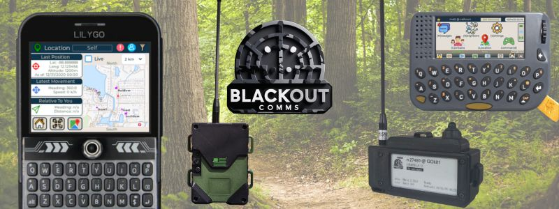

---

## Table of Contents
- [Introduction](#introduction)
- [Terminology: Comms vs Links](#terminology-comms-vs-links)
- [Supported Hardware](#supported-hardware)
- [Core Technical Features](#core-technical-features)
- [Range & Distance](#range-distance)
- [Using Blackout Comms](#using-blackout-comms)
- [Configuration](#configuration)
- [Quick Start – 15 Minute Setup](#quick-start)
- [Onboarding New Nodes](#onboarding-new-nodes)
- [Troubleshooting](#troubleshooting)
- [Safety, Legal, and Support](#safety-legal-and-support)
- [Appendix](#appendix)

---

## Introduction

Blackout Comms is a practical, decentralized mesh networking system built for reliable off-grid text and data communications.

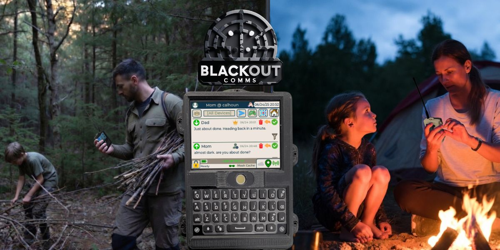

It uses LoRa hardware to create a private mesh that requires no internet or cellular service. Messages automatically route through available nodes.

---

## Terminology: Comms vs Links

Within Blackout Comms, we use specific terms for clarity:

- **Comms** — These are the user-facing devices you actively message from (typically T-Deck units with screens and keyboards). They are what most people carry or keep at their location for sending/receiving messages.

- **Links** — These are dedicated repeater devices (often Heltec V4 or similar) whose main job is to extend the mesh by automatically relaying messages. They usually run in a low-power mode and may be placed in elevated or strategic locations.

- **Node** — A generic term that can refer to either a Comm or a Link. You will see “node” used when talking about the overall mesh.

**Why this matters:**  
A strong mesh usually consists of a mix of **Comms** (for people) and **Links** (for coverage). Understanding the difference helps when planning your deployment.

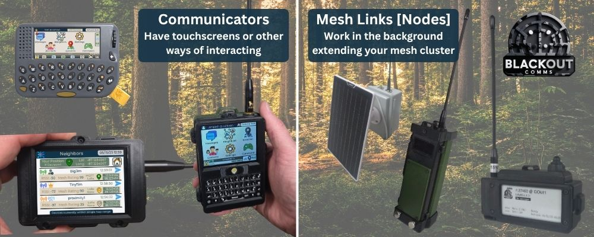

---

## Supported Hardware

Blackout Comms supports a range of devices for both **Comms** (messaging devices) and **Links** (repeaters). All devices require the Blackout Comms firmware.

### Communicator Options
- **Lilygo T-Deck / T-Deck Plus** — Popular choice with keyboard and display. SD card highly recommended for T-Deck Plus.
- **Lilygo Pager** — Nice form factor, portable. SD card highly recommended.
- **Heltec V4 Touchscreen** — Easy setup, compact. No SD card support.

### Link / Repeater Options
- **Lilygo T-Beam Supreme** — Easy to deploy, good performance, GPS capable. Ready to go right out of the box.
- **Heltec Vision Master E290** — Top performer with better display. You have to add GPS and/or realtime clock.
- **Heltec V4** — Versatile for both Comms and Links. Ready right out of the box.
- **Lilygo T-Beam 1W** — Higher power option. Realtime clock recommended, but ready to go right out of the box (add a battery).
- **Lilygo T3S3 OLED / ePaper** — Good for compact or low-power setups. Requires adding GPS and/or realtime clock.

**Note:** [Compatible SD cards](https://www.chatters.io/compatible-sd-cards) are recommended for many communicators for easy backup and device swapping (PNY Elite is good, max of 32 GB). [Full DIY](https://chatters.io/diy) builds are also supported for custom communicators and mesh links.

For the latest compatible device list and build guides, visit [chatters.io/build](https://www.chatters.io/build).

---

## Core Technical Features

### Frequency Hopping
Blackout Comms uses frequency hopping to improve reliability and reduce interference. The system automatically switches between allowed channels according to the selected regional plan. This helps maintain connections in noisy RF environments and complies with regulatory limits.
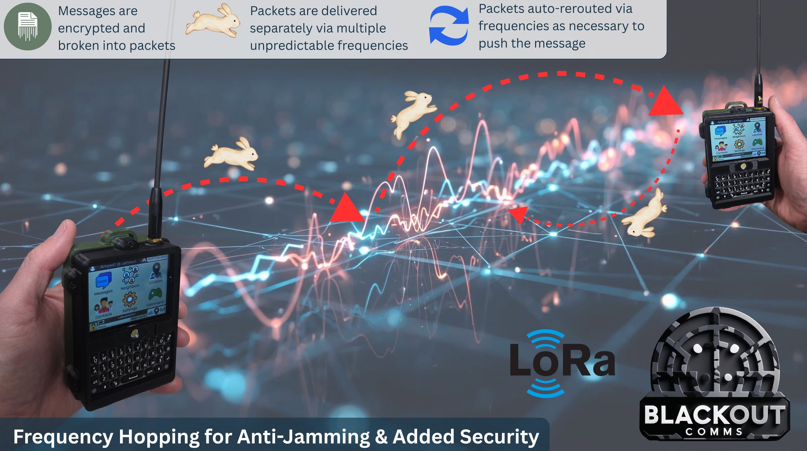

### Encryption
All messages are encrypted end-to-end using strong AES-256 encryption. Only nodes with the correct network key can decrypt traffic. The encryption key should be treated as sensitive information and changed periodically for high-security meshes.

### Digital Signatures
Every message is cryptographically signed with the sending devices’s private key. This allows receiving devices to verify the message truly came from the claimed sender and was not tampered with in transit. This provides strong authenticity in addition to confidentiality. The message expiry time is also part of the signed messages. This prevents replay attacks. 

### Mesh Memory
Blackout Comms devices maintain a local store called mesh memory that holds encrypted message packets in flight, current locations of all devices in the cluster, and connectivity patterns between devices. Every device keeps its own complete copy of the mesh memory, making the system fully decentralized. As new information arrives, each device continuously updates its local copy.
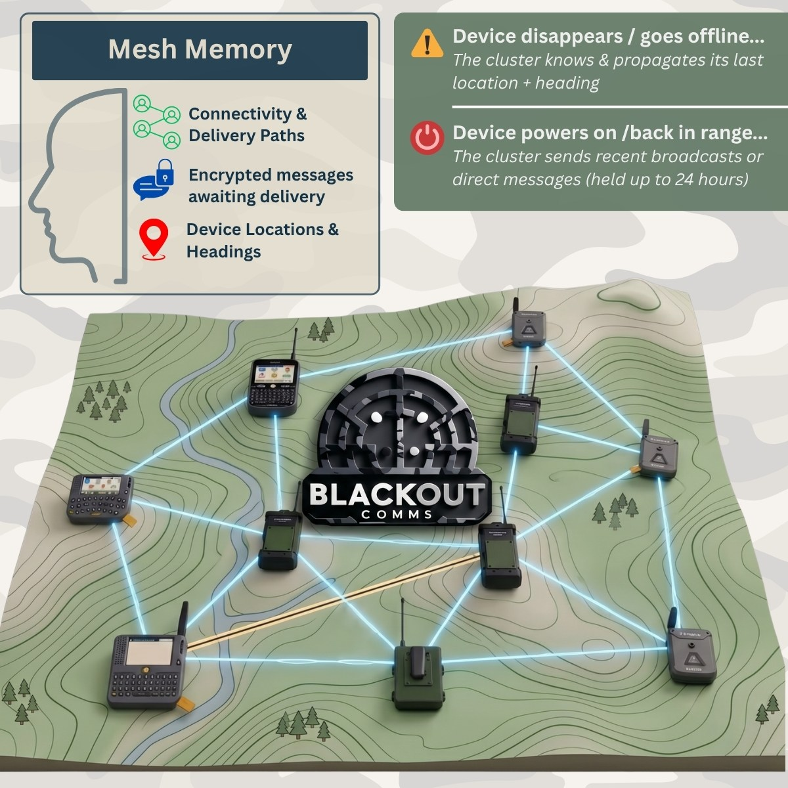
This design improves reliability for delayed delivery and gives users better situational awareness even in dynamic or intermittent off-grid conditions. Mesh memory is automatically managed to stay within hardware limits by dropping older data as needed.

---

## Range & Distance
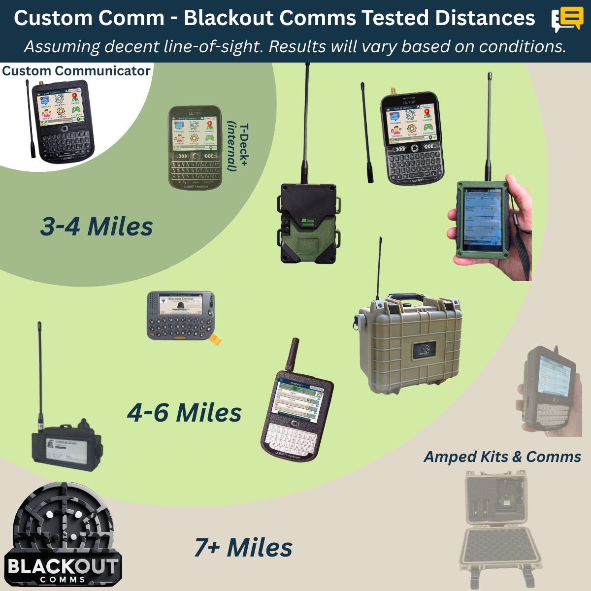
Real-world range with Blackout Comms depends on many variables. Here are practical expectations and tips:

### Typical Range
- **Urban / Forested areas**: 0.5 – 3 miles per hop (line-of-sight is rare)
- **Open countryside / rural**: 4 – 6+ miles per hop with stock antennas
- **Elevated / hilltop nodes**: 10 – 20+ miles possible with good elevation and clear line-of-sight

**Important**: These are per-hop distances using low power equipment (~0.2 watts). The mesh extends total coverage by relaying messages through multiple nodes.

### Factors That Affect Range
- **Antenna height and type** — Elevation is the #1 improvement - for large gaps between your mesh, directional (yagi) antennas often make a huge difference
- **Terrain** — Hills, dense trees, and buildings reduce range significantly
- **Transmit power** — Higher power increases range - check into 1 watt amps if you need more power
- **Weather** — Heavy rain or snow can reduce performance
- **Interference** — Other radio sources in the area

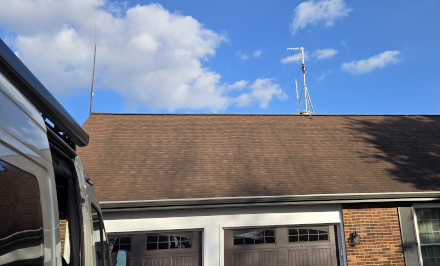

### Practical Tips for Better Range
1. Place antennas for stationary links as high as possible (rooftops, hills, towers).
2. Use higher-gain antennas on stationary links.
3. Test your actual range in your environment — results vary widely.
4. Build a mesh with multiple links rather than relying on long single hops.
5. Consider using amps or amped devices (T-Beam 1W) for stationary links

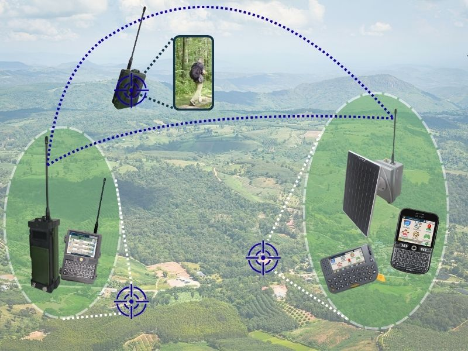

---

# Using Blackout Comms

Blackout Comms automatically boots up to the home screen. If your device is already part of the cluster, it will immediately join up with any nearby devices and you'll see connectivity established (antenna icon in lower-right area of the screen)

### Home Screen
This is your default view on a comm. Any time, click the scroll wheel to return to this screen.

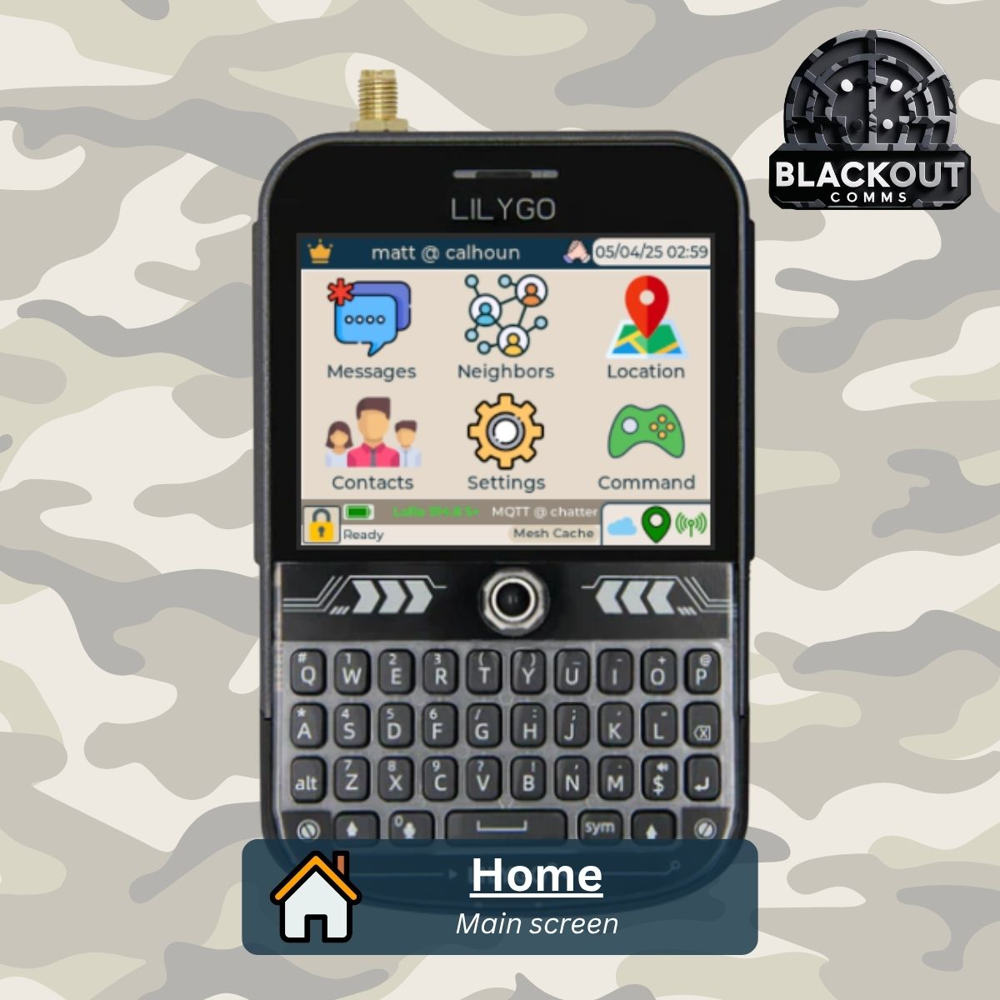

- One-touch access to messages, neighbors, location, contacts, settings, or commands
- A red star indicates you've received a message
- Colored GPS icon means you've got a good location fix
- Time shown upper right, should always be accurate. If not, you'll be invisible to the cluster
- Icon - upper left, shows your device role (root or non-root)

### Viewing Neighbors
This shows you who is currently within direct RF range. Toggle the switch at the bottom of the screen to see beyond-range (mesh range) devices.

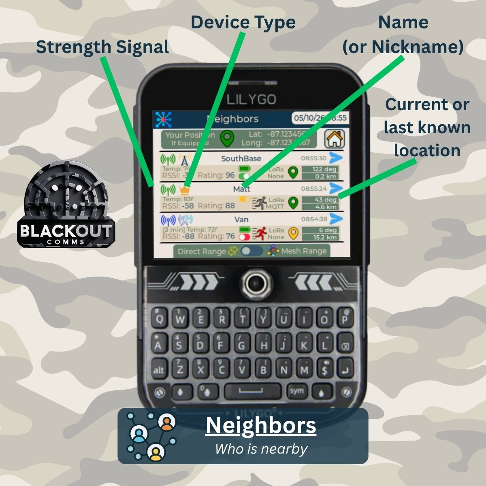

- Icon for each neighbor shows the device type (see appendix for icons)
- Strength signal, device name/nickname, and timestamp for last ping received are shown
- Battery level is shown (if other device supports it)
- Location relative to you is shown for each device (heading, distance)
- Touch the GPS icon to view a map of the other device's last known position, heading, and speed
- Touch the message icon to send a text message to the device

### Viewing Location
Locations can be viewed directly on the device, or on Blackout Comms Live app, if you are connected via BLE. This guide shows on-device location information. Watch a [video demo](https://youtu.be/-HE9BgHpe80) showing how mapping works on T-Deck.

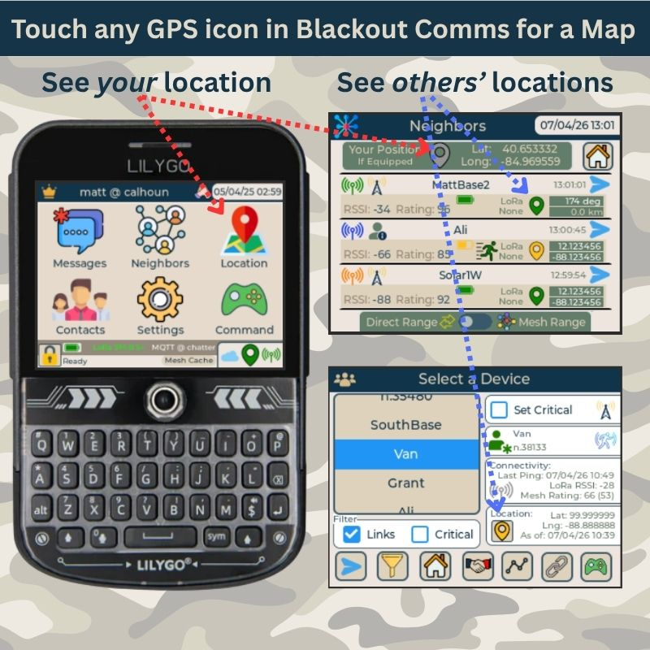

- You can view location on device as a map (if you have a licensed device and have downloaded maps)
- You can also touch the QR button to view a QR code, which contains scannable lat/lon coordinates for any device
- Alongside the QR or map, you can see the coordinates, heading, speed, and timestamp of the location

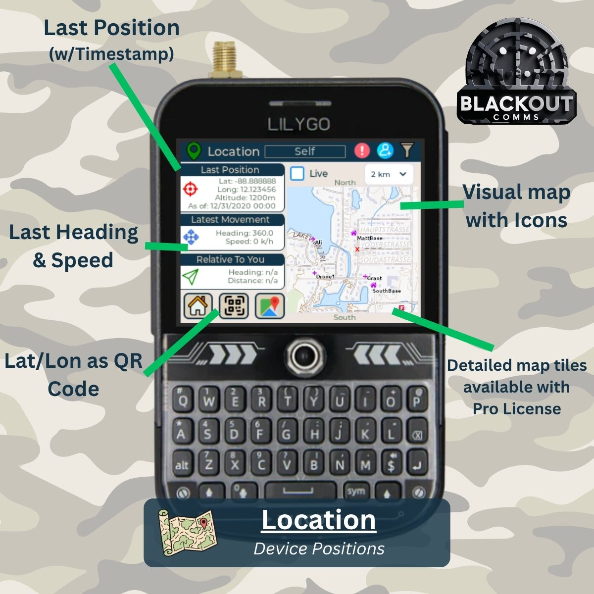

### Contacts
The contacts screen shows all the known contacts in your cluster. If new devices are onboarded by your root device, they'll eventually show up in your contacts list automatically, due to zero touch trust (unless you lock your truststore).

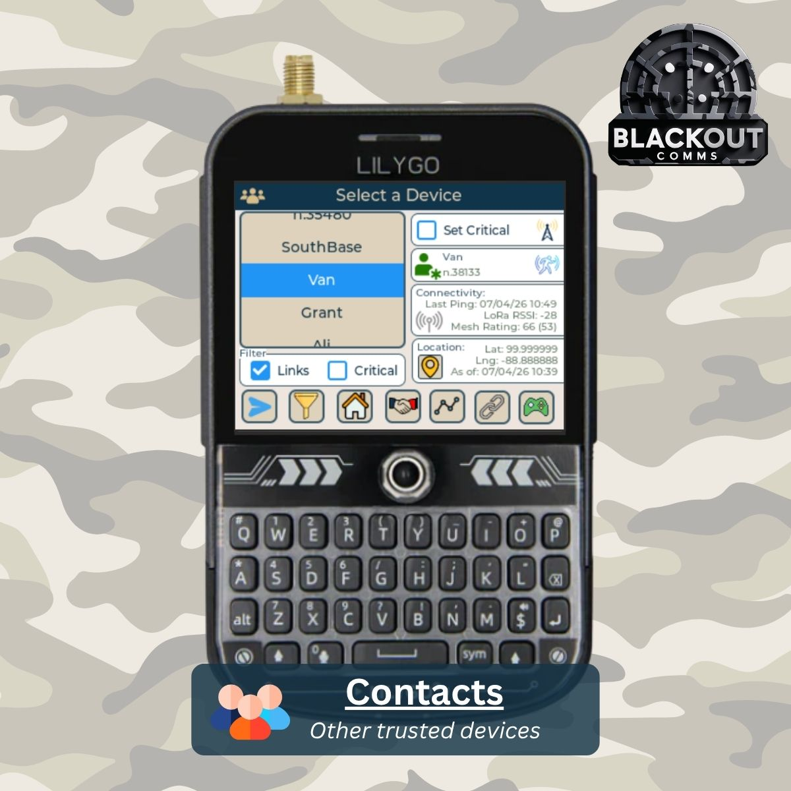

- Scroll to see all contacts
- Touch the icon next to their alias to set a nickname
- Marking contacts as critical makes them appear on your default map, and allows you to filter quickly in other locations of the firmware
- See last ping, last known location, and device type
- Send a message by touching the message button
- The handshake button broadcasts the selected device identity to all in-range devices. This can speed up the trust process, if the device is showing as "unidentified" to some devices.
- The path button shows the likely hops a message would take to reach the selected device from you
- The link button shows the selected device's connectivity with other devices
- The command/game button allows you to issue a remote command to the selected device. The selected device must have remote commands enabled.

### Viewing Messages
On the messages screen, scroll up and down by swiping. You can reply, delete, or filter to specific people.

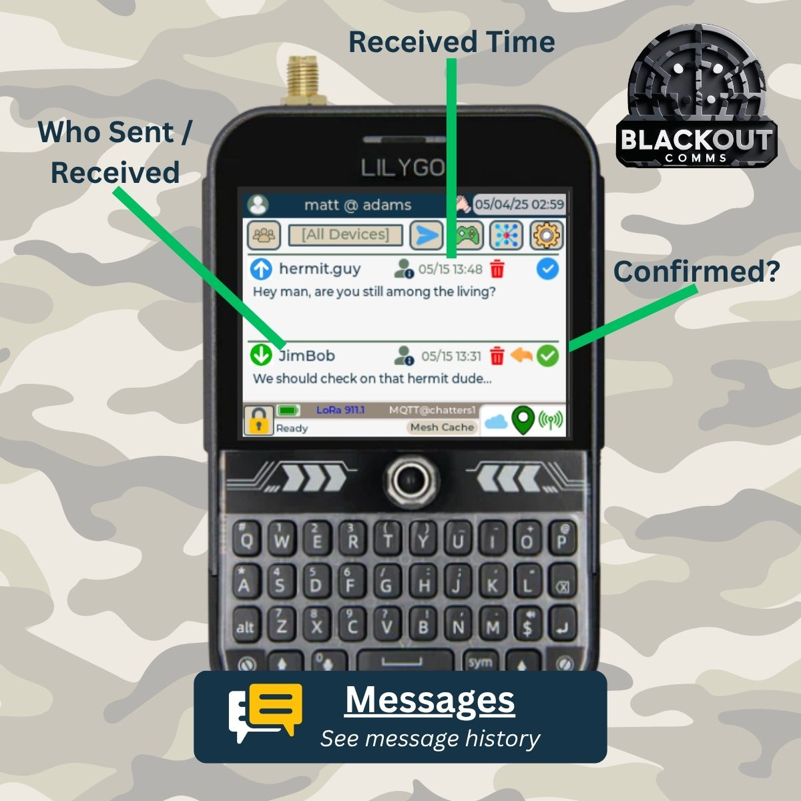

### Sending Messages
Touch any message icon in the firmware to begin sending a message. If you choose "All Devices", you'll be sending a secure broadcast. Otherwise, you'll be sending a direct message. Scroll down to the message types in the appendix to see the difference.

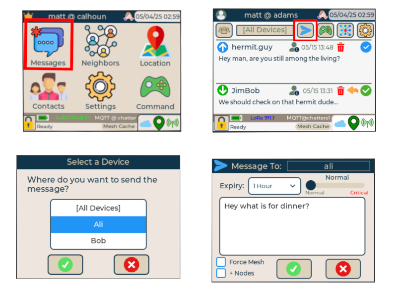

- Expiry controls how long the message delivery should be attempted before failing. In a large, moving, or intermittently-connected mesh network, you may want to allow hours for the receiving device to power-on or come within range
- When devices are within direct range, delivery usually happens and is confirmed within seconds
- Force mesh skips immediate delivery attempt, and queues it for mesh delivery
- The Nodes/Links checkbox (if it'd a broadcast and not DM) will instruct mesh links to display the broadcast, if they are equipped with a display
- Direct messages are only viewable to the end recipient, no matter how many devices the message hops through
- Priority (Normal, Critical, etc) controls how the message appears to other devices. In the future, this may also control how often retries happen or how mesh queues are ordered.

### Remote Commands
_This section is coming soon._

--- 

## Configuration

Configuration of comms can be changed on the settings screen. For links, configuration changes must be done via remote commands. All of the following settings are available for comms, not all are available for change on links.

### Device Settings
These are settings specific to just your device (display settings, alerts, etc).

| Name                        | Description                     
|-----------------------------|------------------------------------
| Firmware Version | Displays version of Blackout Comms you're running (read-only)
| Bluetooth Enabled | If enabled, allows connectivity via BLE ([Blackout Comms Live app](https://www.chatters.io/using-blackout-comms-live)). Disable to increaes battery life.
| Sound Enabled | Play a sound (if equipped) when messages are received
| Vibrate Enabled | Vibrate (if equipped) when messages are received
| Backlight Level | Controls how bright the screen is
| Firmware License | Whether the device has a Pro License
| Screen Sleep | Length of inactivity before the screen powers off
| DST Enabled | Whether DST is enabled or not. This must be manually enabled/disabled as necessary
| Time Zone | Which timezone the device is in. This is for display only, as all devices follow GMT
| Language | Language of the device
| Device ID | The unique ID of the device
| Uptime | How long the device has been running since last reboot
| Time | Current time - only the root can manually change time
| Reset Day Zero | If your device has somehow skipped ahead in time, you may want to choose this to force it to sense the current time again
| Factory Reset | Deletes all device settings (including license). You can also do this simply by replacing the SD card or deleting SD card contents.

### Cluster Settings
These are settings related to the private cluster(s) your device is part of.

| Name                        | Description                     
|-----------------------------|------------------------------------
| Enable Nicknames | On any comm, you can choose private "nicknames" for other devices. They're only visible on YOUR comm. Nicknames can be set on the contacts screen.
| Show Ping Log | If enabled, a panel shows up on the home screen displaying each ping as it arrives. If you need this functionality, it's recommended to use the [Blackout Comms Live app](https://www.chatters.io/using-blackout-comms-live) instead.
| Broadcast Time | Broadcasts the current time, unencrypted, on 915.0, 868.0, or 433.0 mHz, depending on your country / RF zone. This can allow nearby devices that are stuck on the "acquiring GPS" screen to skip past it.
| Broadcast Identity | This is typcially unnecessary, but can help if you're showing up as "unidentified" to another device in your cluster. It broadcasts your device's public key and root-signed proof of identity (see [zero touch trust](https://www.chatters.io/zero-touch-trust)).
| Your Address | Shows your unique numeric address within your private cluster. You typically would never need to know this.
| Change Cluster | If your device has more than one cluster configured, this allows you to switch to the other cluster. You can also accomplish this by using multiple SD cards instead (switch SD cards per-cluster) |
| Join Cluster | Join an existing cluster. Must be near a root device which is also in onboard mode. |
| Onboard Device | Add a new device to your cluster. Only root can do this. |
| Onboard Anon Link | Experimental feature that allows you to add an unlimited number of anonymous links to your cluster. This enables adding basic "repeaters" without using any of the 90 device slots of your cluster.
| Create Cluster | Create a new cluster, of which this device will be the root
| Delete Cluster | Delete this device's connection to the cluster. The cluster itself runs completely independent of any device - even the root. So deleting a cluster has no effect on other devices that are already in the cluster.
| Receive Time | If your device's time has separated from the rest of the cluster's time, you may need to adjust it. The easiest way (barring GPS) is to receive time, while another trusted device is broadcasting it.

### Mesh Settings
This group of settings is for controlling interaction between this device and Meshcore nodes. For more information about this capability, see [here](https://www.chatters.io/meshcore). 

**Blackout Comms Native** is the default protocol for Blackout Comms, offering the best functionality and highest security. It enforces encryption + digital signatures + frequency hopping.

**Blackout Comms via MeshCore** enables Blackout Comms to float atop the MeshCore protocol, by using MeshCore's channel feature. This can allow Blackout Comms to utilize MeshCore repeaters, depending on their configuration. In this mode, all messages are still encrypted and signed, but are also wrapped inside a MeshCore message (or set of messages).

**MeshCore Native** is simply acting as a basic MeshCore client, sitting on a single frequency, and offers the lowest security and no digital signatures. It's available in the firmware in case you want to communicate with non-Blackout Comms devices.

| Name                        | Description                     
|-----------------------------|------------------------------------
| Current Network | Which network (Blackout Comms, Blackout Comms via Meshcore, or Meshcore) your device is currently on (may change after reboot)
| Default Network | Which network your device should use at startup
| Meshcore Network | Frequency / RF settings you want to use for MeshCore-enabled modes.
| Network Mixing | Whether your device should automatically hop between Blackout Comms and Meshcore networks
| Meshcore Alias | What alias your device should use when sending messages using Meshcore protocols
| Channel 1 | When using meshcore channels to communicate with non-Blackout Comms devices, which default channel should be used 
| Channel 2 | When using meshcore channels to communicate with non-Blackout Comms devices, which secondary channel should be used

### Smart Mesh Settings
These settings control how your device interacts with your Blackout Comms cluster. 

| Name                        | Description                     
|-----------------------------|------------------------------------
| Stealth Mode | To avoid detection (or just reduce RF footprint) you may want to experiment with [stealth modes](https://www.chatters.io/stealth-modes). See the appendix for more info. Stealth Disabled is the default and allows full normal functionality. Stealth Low stops pings if no trusted devices are around. Medium disables pings, but still allows messaging, acknowledgements, and mesh forwarding. High basically makes the radio invisible, even to trusted devices, but allows you to receive pings and broadcasts (not DMs).
| Prompt Before Mesh | If you send a DM and it's not immediately acknlowledged, your device will queue it for automatic meshing. If you'd rather be prompted in this case (to resend or cancel), enable this.
| Clear Mesh Cache | If you want to remove any cached packets from your mesh queue, this will do it. You can also touch the _mesh cache_ icon on the home screen
| Mesh Syncing | If you want to disable meshing and only to immediate / RF range messaging, you can disable meshing here. This will also disable your location sharing, since that's done using meshing.
| Mesh Reset | Clears your device's copy of the cluster's [mesh memory](https://www.chatters.io/mesh-memory). It will automatically be re-built for you by nearby devices.
| Remote Commands | Allows this device to receive and automatically respond to remote commands from trusted devices. Note that one remote command that can't be disabled is "Remote Wipe". The root device can remotely factory reset any on-cluster device within mesh range.
| Auto-Broadcast Time | Automatically broadcast time on your RF zone's center frequency (915.0 mHz in the USA). This helps other nearby devices start without GPS, if they have no onboard clock, but you can disable this.

### Security Settings
The default security settings are good for most cases. If you are very concerned with security, it's recommended to use devices with a built-in realtime clock (DS3231) and consider enabling Time Lock to prevent GPS spoofing from affecting your cluster.

| Name                        | Description                     
|-----------------------------|------------------------------------
| SD Locked/Portable | Whether the SD card is allowed to be moved to another comm
| Change Password | Set or change password on this device. It cannot be recovered if lost, and encrypts all data on your device using this password.
| Truststore Lock | Newly onboarded devices are automatically added to your device's "truststore" ([zero touch trust](https://www.chatters.io/zero-touch-trust)). You can disable that here, if you think your root device may be compromised.
| Time Lock | Keeping accurate time is crucial for your Blackout Comms cluster. This is why realtime clocks are highly recommended. If you are concerned with GPS spoofing (and have an RTC), locking time is recommended, once accurate time has been acquired and stored on your RTC. Time Lock will ignore all sources of time besides your onboard RTC.
| Key Forwarding | Part of zero touch trust involves devices notifying one another of newly-onboarded identities and their public keys. This controls whether your device will trust or forward public keys on behalf of other devices, or whether public keys are only trusted/exchanged directly between their respective devices |
| Ignore Expiry | All messages have an expiration and digital signature to prevent replay attacks. You can disable this expiration check, although if meshing is involved, other devices along the way will continue to ignore and not forward expired packets. |
| Connect Serial | Attempts to establish a serial connection (115200 baud) for viewing logs |

### Location Settings
You can enable/disable various location-related features of your device, as well as how it does (or doesn't) display maps. Some mapping features require a pro license. See the [Blackout Comms Location](https://www.chatters.io/location) page for more information about mapping and location features.

| Name                        | Description                     
|-----------------------------|------------------------------------
| GNSS Type | Which GNSS receiver (if any) is detected on the device
| Location Sharing | Whether to automatically broadcast location (encrypted) via mesh
| Map Downloads | Whether to automatically download maps as needed, when WiFi is available. A Pro License is required for this.
| Pre-Download Area | Immediately download maps for the current area or other lat/lon coordinates you choose. WiFi and a pro license are required
| Clear Locations | Removes locations of all other devices from this device's copy of mesh memory. This will automatically be re-built by nearby devices after a while
| Altware Map | Experimental feature, which can make your cluster device positions visible publicly via a web browser. This is not recommended, except for experimentation purposes.
| Tracking Mode | Increases the number of location broadcasts coming from this device, so other devices have a more live picture of where the device is located
| Location Log | Logs all device locations to serial (if connected)
| Publish Locations | Experimental feature, which can make your cluster device positions visible publicly via a web browser. This is not recommended, except for experimentation purposes.
| Location Enabled | Enables or disables GNSS on the device. This can save battery, but you lose location capability.
| Use GPS | Use GPS (American) satellites for location
| Use Glonass | Use Glonass (Russian) satellites for location
| Use BeiDou | Use BeiDou (Chinese) satellites for location

### Storage Settings
All potentially sensitive data is stored encrypted on your SD card or flash memory.

| Name                        | Description                     
|-----------------------------|------------------------------------
| Clear Messages | Removes all messages from storage. This does not remove stored locations.
| Message History | If disabled, messages are only stored in RAM (encrypted) and disappear after reboot.
| Prune Storage | If your device becomes sluggish or starts extremely slowly, it may need "Pruned". This setting forces a full pruning. It can take quite a while (5-10 minutes or more), but should improve performance afterwards.

### BC Channel Settings
Blackout Comms supports [encrypted/open channel](https://www.chatters.io/blackout-comms-public-channels) functionality where any number of devices can co-exist _outside_ a private cluster (with somewhat-reduced functionality), but still communicate using encryption, signatures, and frequency hopping. In this mode, devices don't have an assigned identity. Channels are essentially a series of 4 passwords that control frequency hopping, encryption, and signature validation.

| Name                        | Description                     
|-----------------------------|------------------------------------
| Change Channel | Switch to a different channel
| New Channel | Create a new channel
| Receive Channel | Receive full configuration for a channel, which must be broadcast by a nearby device
| Delete Channel | Delete the configuration for this channel

### LoRa Settings
LoRa is the default way Blackout Comms devices communicate, but there are other ways.

| Name                        | Description                     
|-----------------------------|------------------------------------
| LoRa Enabled | At least one communication method must be enabled. If your device has Cloud, MQTT, or UDP enabled, you may disable LoRa.

### WiFi Settings
If you want to use WiFi for downloading maps or using Cloud/MQTT, this is where you add WiFi connections. Only 2.4 GHz is supported, and the devices are quite picky about which routers can work.

WiFi uses additional battery and can make your device sluggish when joining a network.

| Name                        | Description                     
|-----------------------------|------------------------------------
| Add Network | Configure a new SSID / network
| Delete Network | Delete an existing SSID / network
| Current Network | Which WiFi network you are currently connected to
| Auto Reboot | If your device loses and can't re-establish WiFi connectivity, this will cause it to automatically reboot, resetting the WiFi hardware

### Mesh Cloud Settings
In addition to LoRa communication, Blackout Comms supports [MQTT](https://www.chatters.io/blackout-comms-mqtt) and [Cloud](https://www.chatters.io/cloud). These options allow you to form long distance bridges between devices or device groups in your cluster. All messages and locations are still E2E encrypted.

| Name                        | Description                     
|-----------------------------|------------------------------------
| Cloud Setup | Configure cloud or MQTT on your device. For cloud, configuration is simply scanning a QR code. For MQTT, you'll enter MQTT server settings.
| Cloud Enabled | Whether to use cloud (if configured & WiFi connected)
| MQTT Eanbled | Whether to use MQTT
| Prefer Cloud | If a device is reachable both via LoRa and cloud, Blackout Comms will generally prefer LoRa. You can adjust it to prefer cloud in this case.

### Backpack Settings
For DIY setups, you can add various sensors and other hardware modules (known as _backpacks_) directly to a communicator. This allows you to enable/disable backpack-related settings.

| Name                        | Description                     
|-----------------------------|------------------------------------
| Remote Commands | Whether to allow any attached backpacks to auto-respond to remote commands from trusted devices
| Analog Relay | Whether or not an analog relay is attached
| Motion Notify | Whether to notify other devices if motion is sensed (via attached motion sensor)
| Notify Who | Who to notify if motion is sensed
| Motion Reset | Amount of time to ignore further motion after motion is sensed
| Motion = Relay | If motion is sensed, automatically trigger relay (if attached) for 5 seconds

### UDP Settings
Not enabled in current version of the firmware

---

## Quick Start – 15 Minute Setup
Online Guides:
- [Set Up a Cluster in 15 minutes](https://x.com/altwaredev/status/2068417264643424606) (includes video demos)
- [Set Up a Cluster of T-decks](https://x.com/altwaredev/status/2071940939350753496) (super easy)

### Step 1: Install Firmware
1. If using SD card (recommended), insert it now. The SD card should be fat formatted. Most new SD cards are already formatted. The max SD size supported is 32 GB. Not all SD cards work. PNY Elite is a good choice.

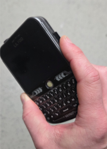

2. Connect your device to your computer via USB.

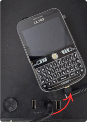

3. Disconnect and power cycle the device.

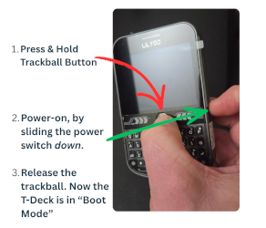

4. In Chrome, Brave, or othe "mainstream" browser, go to [chatters.io/flash](https://chatters.io/flash) to install Blackout Comms in a few clicks.

### Step 2: Initial Configuration

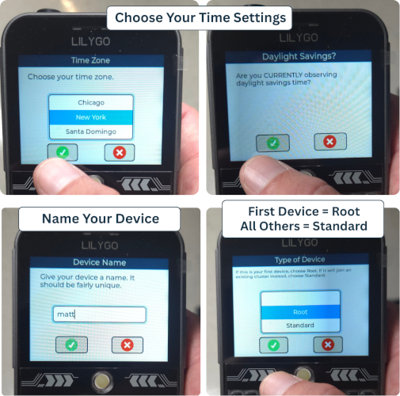

1. Power on the device. It may take a moment to acquire a GPS signal. If necessary, move outside or near a window.
2. Choose your language and time zone. These can be change later if you need to.
2. Set your device name (any letters/numbers up to 12 digits). Examples: "Matt", "mom", "comm1", etc. This can NOT be changed later, unless you factory reset the device or use more than one SD card.
3. Choose "Root" or "Standard". If this is the first device, it will be the root (admin) of your cluster, so choose "Root". For all remaining devices, choose "Standard".
4. If you chose root, the last step is to set up the cluster, which is just naming the cluster and choosing some final cluster-wide settings. Your cluster name can any 12 digits, ex: "home", "Smith1", etc. The remaining cluster settings are more technical and you can just choose "Simple" setup type to use defaults, which are good for the USA. If you are outside the USA, choose advanced.

### Step 3: Flash / Configure Additional Comms/Links
1. Repeat flashing & configuration on one or more additional comms/links
2. On Links, there is no setup, other than flashing the device. The rest of link setup is done automatically during onboarding.

---

## Onboarding

Onboarding is the one time process of adding a new device (Comm or Link) to your existing Blackout Comms cluster so it can securely communicate with the other devices. Only the root device can onboard new devices to your private cluster.

For onboarding, you put the root device into "Onboard New Device" mode, and you also put the new device in "Join Cluster" mode. This is done in device settings on each device. New Links are already in onboard mode, so they skip that step.

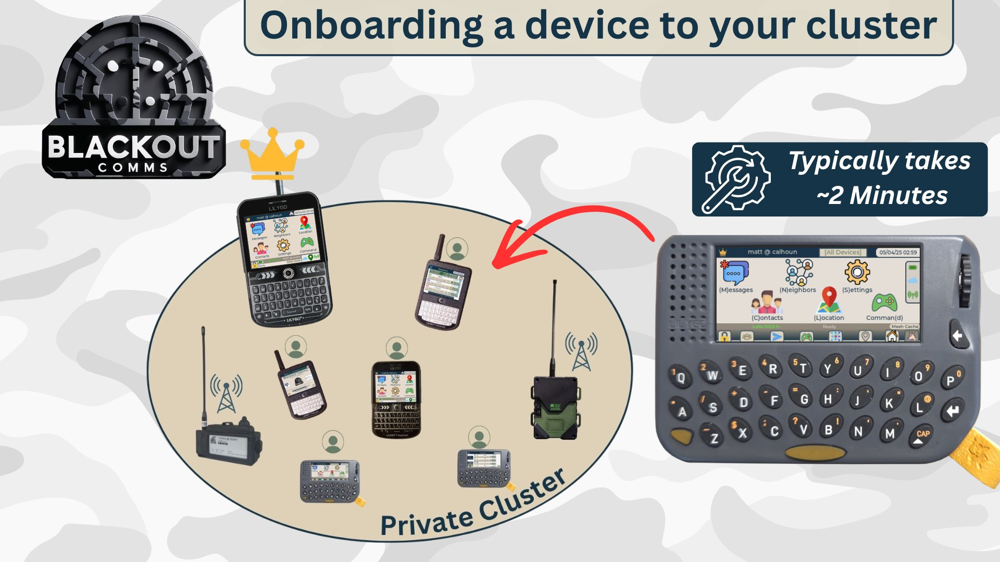

During onboarding, the devices will automatically exchange information (encrypted) over LoRa, including everything the new device needs to participate in the private mesh cluster.

After onboarding, your new device will be able to fully participaate in your private cluster, and it will have proof it belongs to the cluster, which is automatically recognized by your existing devices. This is called [zero touch trust](https://www.chatters.io/zero-touch-trust), and is a core security feature of Blackout Comms.

**IMPORTANT: When onboarding, ensure _no other devices_ (including links) are currently in Onboard Mode!!** They would likely interfere.

### Onboarding a Comm

1. On your root device, go to settings and choose: _Cluster / Onboard New Device_
2. On the new _comm_, go to settings and choose: _Cluster / Join Cluster_
3. The devices will automatically exchange information for a few minutes and reboot
4. Your new comm is now part of your cluster! You can verify by checking the neighbors screen of any comm. For the first few minutes, it may show as "unidentified" to some devices. That should autmomatically resolve, just by leaving the devices alone for a while.
5. (Optional) If you're in a hurry, you can go into the new device's settings and choose "Broadcast Identity".

### Onboarding a Link

1. Ensure the new link is powered on and showing "Onboard" somewhere on its display. This happens automatically when it's first powered on (or if you change its SD card)
2. On your root device, go to settings and choose: _Cluster / Onboard New Device_
3. The devices will automatically exchange information for a few minutes and reboot.
4. Your new link is now part of your cluster! You can verify by checking the neighbors screen of any comm. For the first few minutes, it may show as "unidentified" to some devices. That should autmomatically resolve, just by leaving the devices alone for a while.
5. (Optional) If you're in a hurry, you can go into the root's contacts screen, selecting the new node, and clicking the "handshake" button.

---

# Troubleshooting

| Issue         | Possible Cause  |  Solution                                 |
|---------------|-----------------|-------------------------------------------|
| Device Invisible to Others | Not yet onboarded | Onboard the device |
| Device Invisible to Others | Inaccurate Time | Verify the time/date are correct, reset to day zero and reacquire time if necessary, check RTC battery |
| Mapping not working on device | A Pro License and WiFi are required | Get a license, check WiFi connectivity |

---

# Safety, Legal, and Support

**Important Legal Note:**  
Operation must comply with local radio regulations. Frequency hopping and transmit power are constrained to legal limits for unlicensed or licensed operation. Check your local regulations for frequency restrictions.
In the USA, it is recommended to use the "Simple" option during cluster setup, which is intended to keep your RF usage within legal limits. This is not legal advice.

**Security Best Practices:**
- Protect your root device. If compromised, it can add more devices to your cluster.
- Use SD cards on all devices possible and back them up. If you lose a device, you can insert a backed-up SD card into a new T-Deck / Pager / etc, and you're still up and running.

**Support:**  
Website / Updates: 
https://chatters.io
https://x.com/altwaredev

---

## Appendix
### Blackout Comms Important Icons
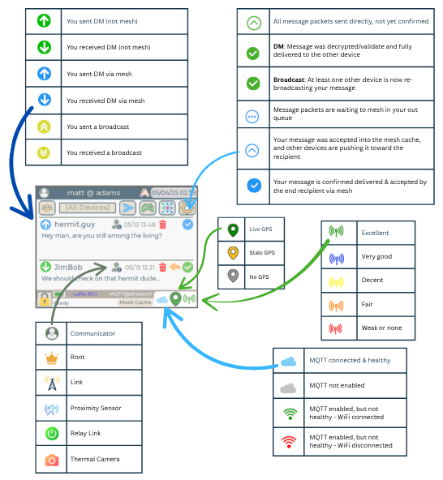

### Blackout Comms Message Types
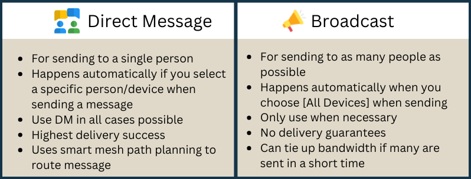

### Blackout Comms Stealth Modes
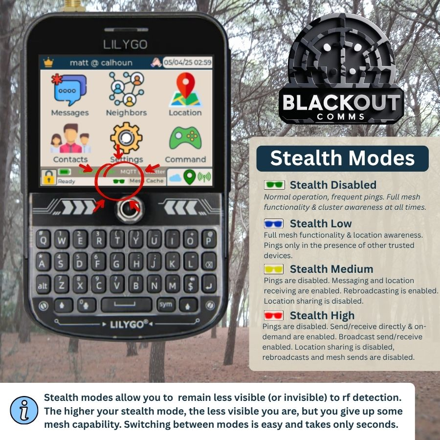
For reducing RF footprint / detection

## Glossary

- **Cluster** — A private group of Blackout Comms devices (Comms and Links) that share the same network name, frequency hopping schedule, RF settings, and symmetric keys. All devices in a cluster can communicate with each other securely. A cluster is essentially your own off-grid mesh network.

- **Communicator (Comm)** — A user-facing device intended for active messaging. Comms usually have screens, keyboards, or other interfaces that let you read and write messages (examples: T-Deck, T-Deck Plus, Pager, Heltec V4 Touchscreen).

- **Link** — A non-user-facing mesh device whose primary role is to extend the range and coverage of the cluster by automatically relaying messages. Links are often placed in elevated or strategic locations and may run with minimal user interaction. Some links _can_ offer user-facing functionality via the Blackout Comms Live app.

- **Node** — A general term that refers to any device (either a Comm or a Link) connected to the mesh.

- **Onboarding** — The process of adding a new device to an existing cluster. This happens after flashing the firmware. During this process, a root device connects with a new device that wants to _join_, they exchange various information (via encrypted LoRa), after which the new device is a fully trusted member of the mesh cluster.

- **Mesh Memory** — An encrypted, decentralized store on each device that holds message packets in flight, locations of devices in the cluster, and connectivity patterns. Every device maintains its own complete copy and continuously updates it as new information arrives.

- **Mesh** — The overall network formed when multiple nodes relay messages to one another, allowing communication beyond direct radio range.

- **Frequency Hopping** — The automatic switching between different radio channels to improve reliability, reduce interference, and stay within regulatory limits.

- **Digital Signature** — A cryptographic proof attached to each message that verifies the sender and ensures the message was not altered in transit.

### Recommended Resources
- [Blackout Comms firmware](https://chatters.io/flash): Get the latest firmware
- [Off-Grid Tracking Demo](https://www.chatters.io/off-grid-tracking) showing mesh memory in action, finding a powered-off device miles away
- [Easy DIY Off-Grid Mesh Comms](https://medium.com/@mattcalhoun1/diy-off-grid-mesh-comms-tracking-easy-15-minute-setup-t-decks-pagers-5ef4ed46b309) 15 minute setup guide for T-Deck & Lilygo Pager
- [Blackout Comms Live](https://www.chatters.io/using-blackout-comms-live) companion app for Android
- [Using Mesh Systems for SHTF](https://medium.com/@mattcalhoun1/my-shtf-comms-stack-and-why-i-dont-rely-on-just-one-system-89dc56ace585): How Blackout Comms or other mesh systems can fit into your emergency preparedness comms plan, in addition to HAM/GMRS

